# SpineAISystem

An Intelligent System for Spine Imaging Analysis and Automated Diagnostic Report Generation.


## 部署说明

需要在`backend_b`文件夹下创建一个`.env`文件夹来存储 API 密钥和其他配置。请将以下内容复制到 `.env` 文件中，并根据实际情况修改（例如，将 `OPENAI_API_KEY` 设置为你自己的 API 密钥）。

```
# OPENAI API 密钥
OPENAI_API_KEY="sk-your-openai-api-key-here"

# LLM 模型设置
LLM_MODEL=gpt-4o-mini

# 端口设置
PORT=8002

# HTTP 和 HTTPS 代理设置（如果需要）
HTTP_PROXY=http://host.docker.internal:7890
HTTPS_PROXY=http://host.docker.internal:7890
```


## 用户操作手册

用户可使用该系统实现对上传的脊柱矢状面X线影像进行椎骨的中心点预测、分割预测、骨折预测以及骨折诊断报告生成等功能。

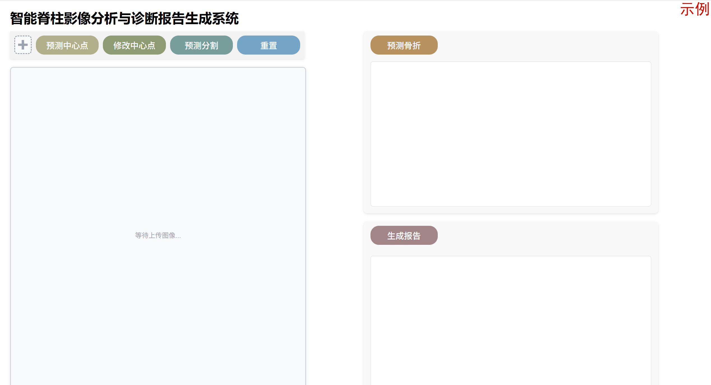

### 1. 上传影像

用户可点击“上传文件框”将需要进行分析的X线图像上传至平台，可使用的图像格式为PNG或MHA格式。上传后可以在“图像展示框”中查看图像。

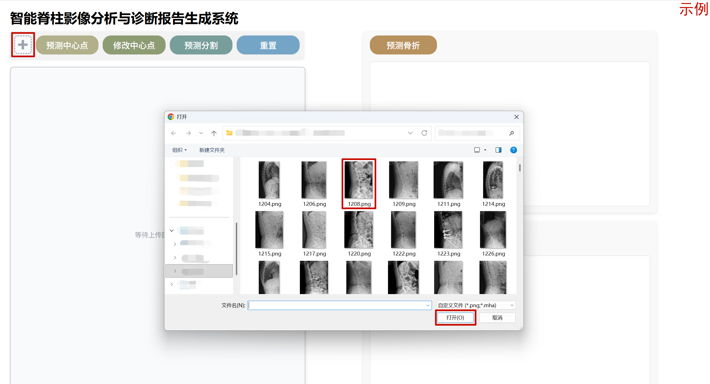

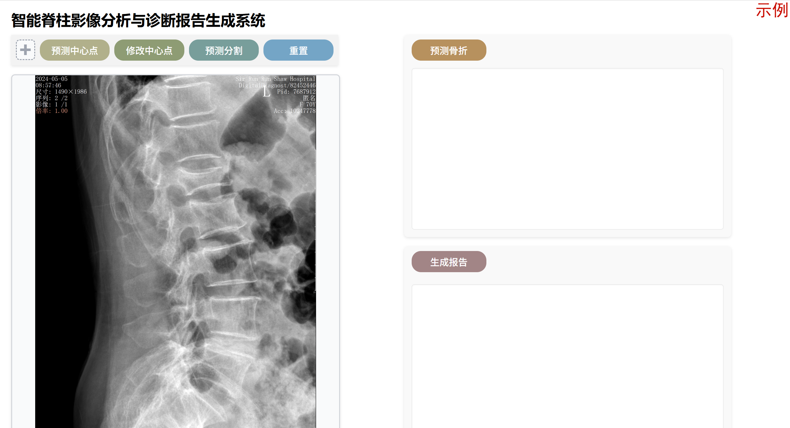

### 2. 预测及修改椎骨中心点

#### 2.1. 预测中心点

点击“预测中心点”，可以得到上传图像的椎骨中心点位置以及类别的预测结果，将鼠标悬浮在坐标点上可以查看预测中心点的具体坐标。

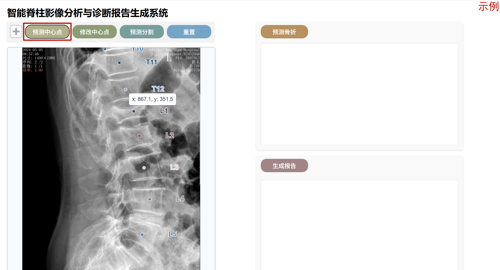

#### 2.2. 修改中心点

用户可以对预测得到的中心点结果进行修改，也可以不预测中心点直接标注中心点。点击“修改中心点”，图像右侧的“椎骨类别按钮栏”将会展开，可对现有的中心点进行增加、修改、删除操作。右键点击中心点可将其删除。

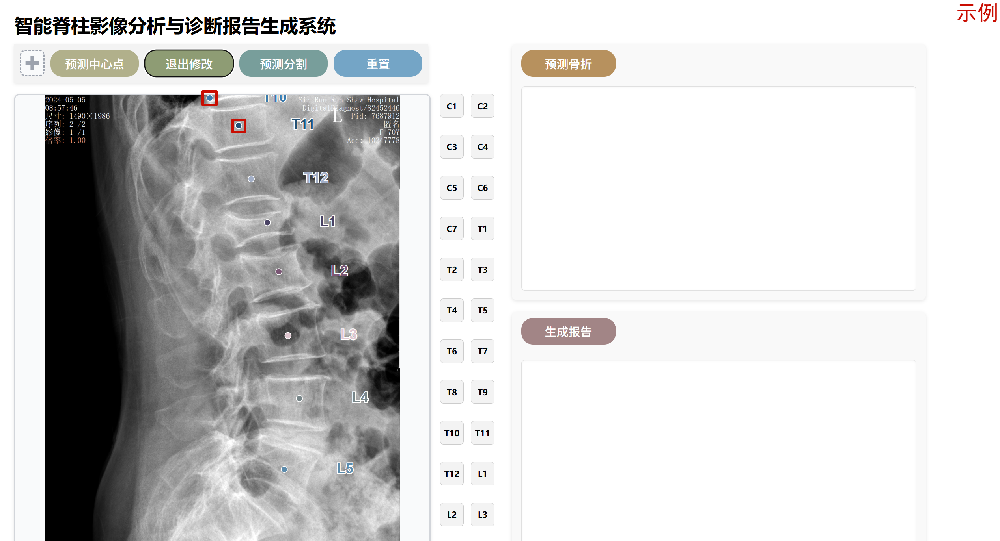


点击需要增加的椎骨类别按钮，再点击正确的位置即可新增对应类别的中心点。

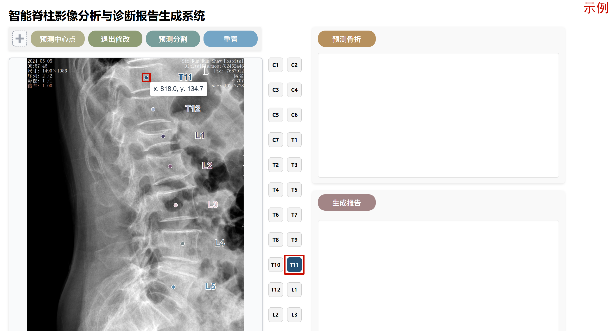

点击需要修改的椎骨类别按钮，再点击正确的位置即可修改对应类别的中心点。

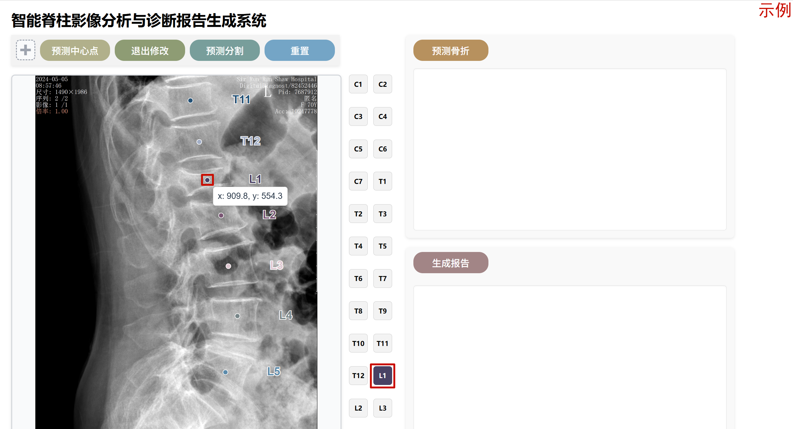

点击“退出修改”或“预测分割”可退出中心点的修改。

### 3. 预测椎骨分割

点击“预测分割”，可以根据中心点预测得到脊柱图像中每个类型椎骨的分割结果。

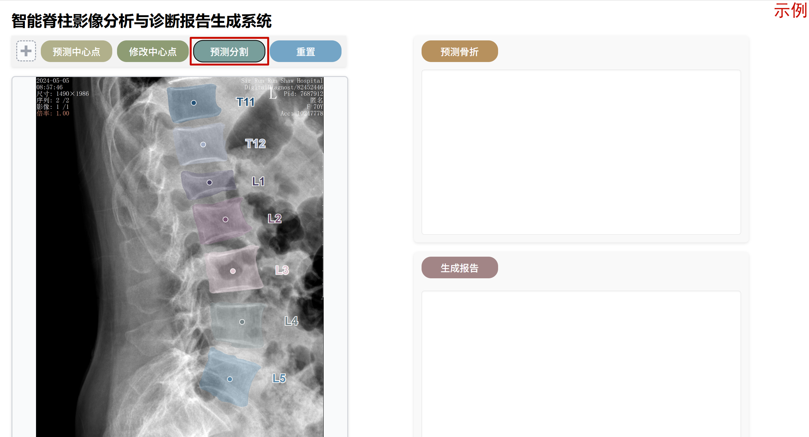

### 4. 预测椎骨骨折

点击“预测骨折”，可以根据各椎骨的分割结果预测得到超过骨折概率阈值（>0.5）的椎骨切片、类型和预测的骨折概率。

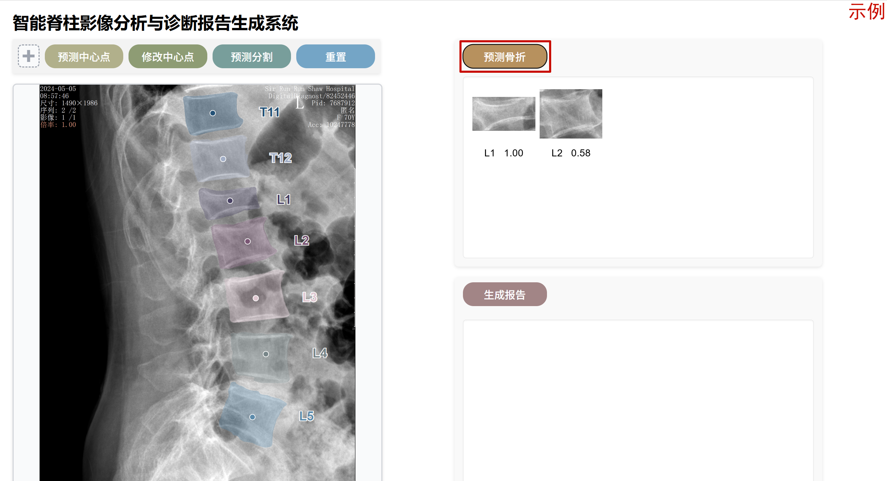

### 5. 生成骨折诊断报告

点击“生成报告”，可以根据各椎骨的骨折概率生成该影像的整体骨折诊断报告，由所选择的ai模型生成影像所见、印象、建议等初步诊断报告。

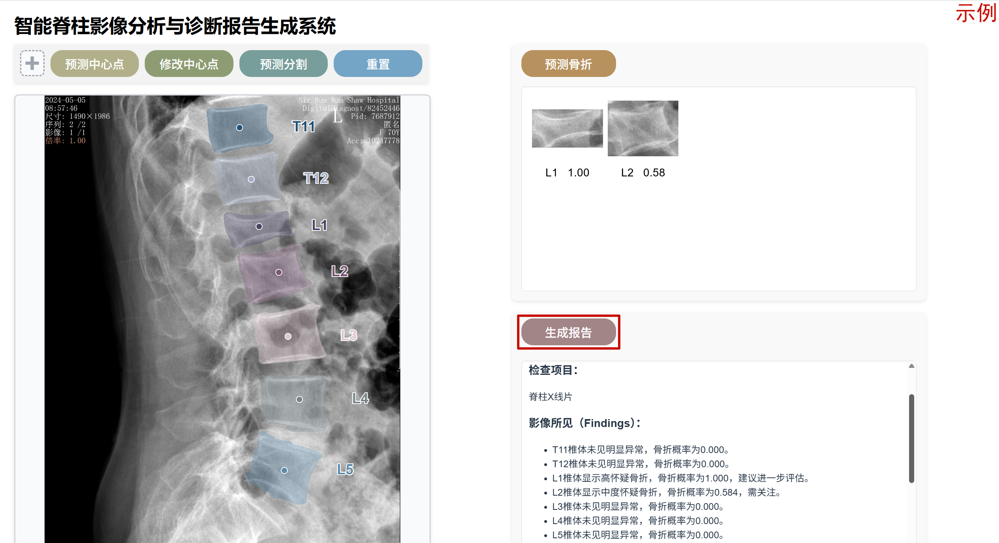

### 6. 重置

点击“重置”，可以清空各种预测结果，在原图上重新进行预测和修改。点击“上传文件框”，可以上传新的影像进行预测和报告生成。

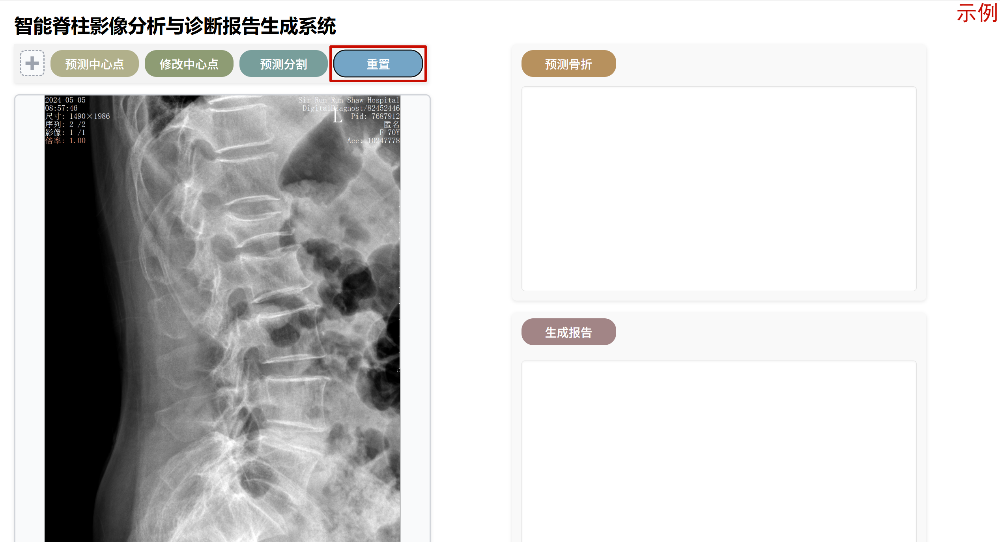
